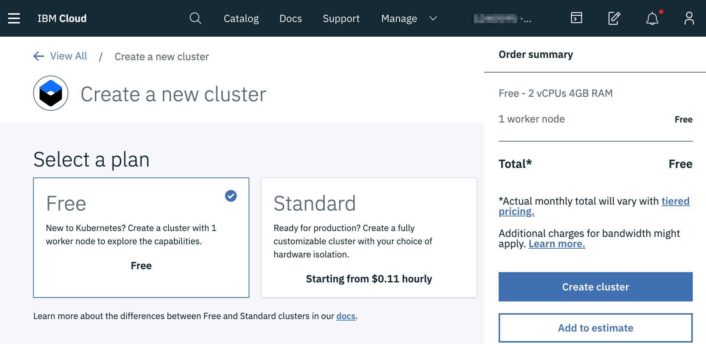
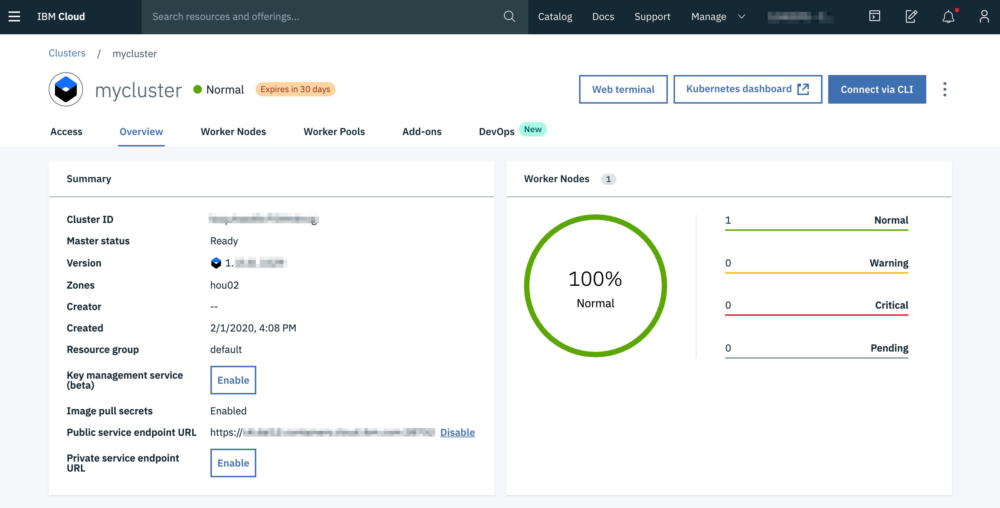
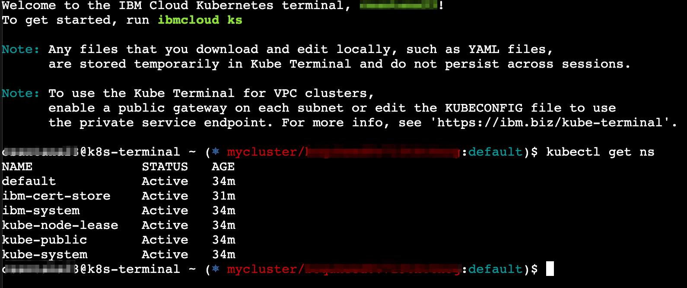

# Using IBM Kubernetes Service as exit inlet node

This tutorial is based on Alex Ellis blog post https://blog.alexellis.io/loan-an-ip-to-your-minikube-cluster/

This tutorial will allow you to expose your local kubernetes (minikube, kind, k3s, crc, etc..) to the internet using another public kubernetes cluster that is already expose to the public.

For the tutorial we'll be using a popular Open Source networking tunnel and service proxy called [inlets](https://inlets.dev/). Inlets is listed on the [CNCF landscape](https://landscape.cncf.io/category=service-proxy&format=card-mode&grouping=no&license=open-source&sort=stars).


## Setup a cloud Kubernetes cluster

IBM Cloud offers 2 flavors of Kubernetes,  Community and Red Hat OpenShift Cluster.
You can use of any of the two for this tutorial.
You can create a 1 node kubernetes cluster for free.

After login into IBM Cloud click [Create Kubernetes](https://cloud.ibm.com/kubernetes/catalog/cluster/create) and select Free Plan.




Once the Cluster is created, you can use the Web Terminal 



Click on Web Terminal to bring up a terminal window you can use `kubectl`



You can also get the kubeconfi via the CLI

You can get your KUBECONFIG via the IBM Cloud CLI
```
ibmcloud ks cluster config --cluster <Cluster ID>
```

## Start an inlets-server on the cloud cluster

```bash
export TOKEN=$(head -c 16 /dev/urandom | md5sum | cut -d" " -f1)
kubectl create secret generic inlets-token --from-literal token=$TOKEN

echo The token is: $TOKEN
```
Save the value of the token on your local workstation with filename `inlets-token.txt` to be use later.
```bash
echo '.....' > inlets-token.txt
```

### Create the exit-server deployment and service
Now create a deployment for the inlets-server:

```bash
cat <<EOF | kubectl apply -f -
apiVersion: apps/v1
kind: Deployment
metadata:
  name: inlets-server
spec:
  replicas: 1
  selector:
    matchLabels:
      app: inlets-server
  template:
    metadata:
      labels:
        app: inlets-server
    spec:
      containers:
      - name: inlets-server
        image: inlets/inlets:2.6.3
        imagePullPolicy: Always
        command: ["inlets"]
        args:
        - "server"
        - "--control-port=8123"
        - "--port=8080"
        - "--token-from=/var/inlets/token"
        volumeMounts:
          - name: inlets-token-volume
            mountPath: /var/inlets/
      volumes:
        - name: inlets-token-volume
          secret:
            secretName: inlets-token
EOF
```
Now we create a service to expose the inlet-server
```bash
cat <<EOF | kubectl apply -f -
apiVersion: v1
kind: Service
metadata:
  name: inlets-server
  labels:
    app: inlets-server
spec:
  type: LoadBalancer
  ports:
    - name: inlets-data
      port: 8080
      protocol: TCP
      targetPort: 8080
      nodePort: 30080
    - name: inlets-control
      port: 8123
      protocol: TCP
      targetPort: 8123
      nodePort: 30023
  selector:
    app: inlets-server
EOF
```

Verify the service
```bash
kubectl get service/inlets-server
NAME            TYPE           CLUSTER-IP      EXTERNAL-IP   PORT(S)                         AGE
inlets-server   LoadBalancer   172.21.19.183   <pending>     8080:30080/TCP,8123:30023/TCP   63m
```

If the `EXTERNAL-IP` it has `<pending>` that's OK for Free Cluster, you don't get a LoadBalancer for Free, but still have a Public IP on the Node.

You can get the IP from the Web Console or the Node yaml
```bash
kubectl get node -o yaml
```
Under `status.addresses` you will see one with type `ExternalIP` then you can use the Node Ports `30023` and `30080`
```yaml
 status:
    addresses:
    - address: 10.47.87.144
      type: InternalIP
    - address: <PUBLIC IP>
      type: ExternalIP
    - address: 10.47.87.144
      type: Hostname
```


Verify deployment is running OK

```
kubectl get deploy/inlets-server
NAME            READY   UP-TO-DATE   AVAILABLE   AGE
inlets-server   1/1     1            1           8m6s
```

```
kubectl logs deploy/inlets-server
2020/02/01 22:00:22 Welcome to inlets.dev! Find out more at https://github.com/inlets/inlets
2020/02/01 22:00:22 Starting server - version 2.6.3
2020/02/01 22:00:22 Control Plane Listening on :8123
2020/02/01 22:00:22 Data Plane Listening on :8080
```

## Deploy the Application in Minikube


Lets use a sample app, create a deployment and service 

```bash
git clone https://github.com/alexellis/expressjs-k8s
cd expressjs-k8s

kubectl apply -f ./yaml/dep.yaml
kubectl apply -f ./yaml/svc.yaml
```

Test it
```bash
kubectl port-forward deploy/expressjs 8080:8080 &
curl -s 127.0.0.1:8080/links | jq
Handling connection for 8080
[
  {
    "name": "github",
    "url": "https://github.com/alexellis"
  },
  {
    "name": "twitter",
    "url": "https://twitter.com/alexellisuk"
  },
  {
    "name": "blog",
    "url": "https://blog.alexellis.io"
  },
  {
    "name": "sponsors",
    "url": "https://github.com/users/alexellis/sponsorship"
  }
]
```

## Start an inlets-client inside (ie minikube)

Create a secret for the inlets-client to use, this must use the value entered in the public cloud cluster:
```bash
kubectl create secret generic inlets-token --from-literal token=$(cat inlets-token.txt)
```

The inlets-client will connect to the inlets-server and establish a bi-directional websocket. For any requests that hit the inlets-server, they will be redirected top the inlets-client inside our local minikube cluster.

We just need to set three things:

- --remote - the remote cluster's Public IP use ws:// for plaintext and wss:// for TLS.
  - If using Free Cluster it doesn't support LoadBalacer, you would need to use the Public IP from the Node, using Node Port `30023`
  - If using Standard Plan, then you can use LoadBalacer, using free domain name provided,  using port `8123`
- --token - the authentication secret name (inlets-token) for the authentication between inlets
- --upstream - the upstream address that inlets needs to point at i.e. http://expressjs.default:8080

For this case I will be using the public IP from the Node you can find using `kubetctl get node -o yaml` and look at the status External IP, or from the Web Console in IBM Cloud under Worker Nodes.

Make sure to replace `<REPLACE_WITH_PUBLIC_IP_OR_DNS>` in the below yaml.

```bash
cat <<EOF | kubectl apply -f -
apiVersion: apps/v1
kind: Deployment
metadata:
  name: inlets-client
spec:
  replicas: 1
  selector:
    matchLabels:
      app: inlets-client
  template:
    metadata:
      labels:
        app: inlets-client
    spec:
      containers:
      - name: inlets-client
        image: inlets/inlets:2.6.3
        imagePullPolicy: Always
        command: ["inlets"]
        args:
        - "client"
        - "--remote=ws://<REPLACE_WITH_PUBLIC_IP_OR_DNS>:30023"
        - "--upstream=http://expressjs.default:8080"
        - "--token-from=/var/inlets/token"
        volumeMounts:
          - name: inlets-token-volume
            mountPath: /var/inlets/
      volumes:
        - name: inlets-token-volume
          secret:
            secretName: inlets-token
EOF
```

Verify inlet-client us OK

```bash
kubectl get deploy/inlets-client
NAME            READY   UP-TO-DATE   AVAILABLE   AGE
inlets-client   1/1     1            1           6m32s

kubectl logs deploy/inlets-client
2020/02/01 22:32:52 Welcome to inlets.dev! Find out more at https://github.com/inlets/inlets
2020/02/01 22:32:52 Starting client - version 2.6.3
2020/02/01 22:32:52 Upstream:  => http://expressjs.default:8080
2020/02/01 22:32:52 Token: "TOKEN=xxxx"
time="2020-02-01T22:32:52Z" level=info msg="Connecting to proxy" url="ws://10.0.0.0:8123/tunnel"
```

Let's tested using the NodePort Port `30080`, I updated my domain name registry to use `inlets-demo.csantanapr.dev` to map to my public IP on the cluster.

```bash
curl -s inlets-demo.csantanapr.dev:30080/links | jq
[
  {
    "name": "github",
    "url": "https://github.com/alexellis"
  },
  {
    "name": "twitter",
    "url": "https://twitter.com/alexellisuk"
  },
  {
    "name": "blog",
    "url": "https://blog.alexellis.io"
  },
  {
    "name": "sponsors",
    "url": "https://github.com/users/alexellis/sponsorship"
  }
]
```
